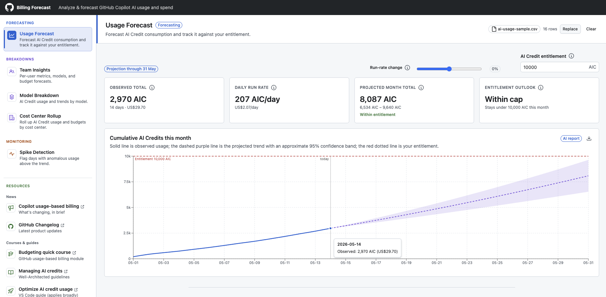

# Copilot Billing Forecast

A client-side toolbox for analyzing and forecasting **GitHub Copilot AI usage and
spend**. Upload a GitHub usage report CSV and explore visualizations, forecasts, and
per-user and per-cost-center insights - all entirely in your browser.



> 🔒 **Your data never leaves your browser.** All CSV parsing, analysis, and
> forecasting happen client-side - there is no server-side processing, upload, or
> persistence beyond the current browser session. See [CONTRIBUTING.md](CONTRIBUTING.md)
> for the full privacy constraint and development guidelines, and
> [docs/analytics.md](docs/analytics.md) for what anonymous analytics are recorded.

> ⚠️ This is **not** an official GitHub product. It is an unofficial tool to help
> customers analyze and forecast their GitHub Copilot AI usage and spend. Figures are
> estimates - always refer to your GitHub billing statements as the source of truth.

## Overview

GitHub Copilot bills AI usage in AI Credits, and it can be hard to tell where those
credits are going or whether you're on track to stay within your entitlement.
Copilot Billing Forecast turns a GitHub usage report into clear, interactive insights:
it projects where your spend is heading, highlights your heaviest users, models, and
cost centers, and surfaces unusual spikes - so you can spot overages before they
happen and plan budgets with confidence.

Everything runs in your browser. You upload a usage report once and switch between the
tools below without your data ever leaving your device.

> This tool is intended for **GitHub Copilot Business and Enterprise** plans, which
> provide the organization and enterprise usage reports it relies on. Individual
> Copilot plans (Free/Pro/Pro+) don't produce these reports and aren't supported.

## Tools

- **Usage Forecast** - Forecast AI Credit consumption and track it against your
  entitlement, with a confidence band, trend indicator, projected exhaustion date, and
  any overage in USD.
- **Team Insights** - Per-user metrics, models, and budget forecasts, including a spend
  distribution and per-user month-end projections against an optional budget.
- **Model Breakdown** - AI Credit usage and trends broken down by model.
- **Spike Detection** - Flag days with anomalous usage above the trend.
- **Cost Center Rollup** - Roll up AI Credit usage and budgets by cost center.

## Usage reports

The app accepts GitHub usage report CSVs (summarized, detailed, and AI usage reports).
For the report types, columns, and how to download them, see the official docs:
[GitHub billing reports reference](https://docs.github.com/en/billing/reference/billing-reports).

The parser tolerates missing optional columns and legacy column names across all
report variants.

## Getting started

```bash
npm install
npm run dev
```

Then open http://localhost:3000 and load a usage report CSV.

## Contributing

See [CONTRIBUTING.md](CONTRIBUTING.md) for the tech stack, architecture and conventions,
local setup, and development guidelines - including the hard client-only data privacy
constraint.
